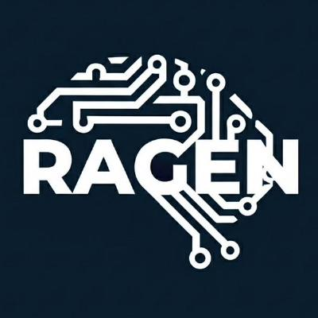
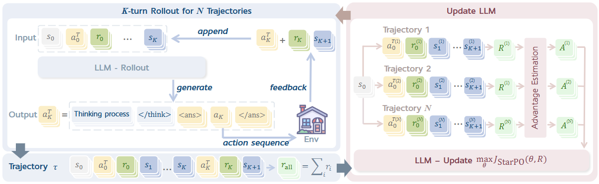
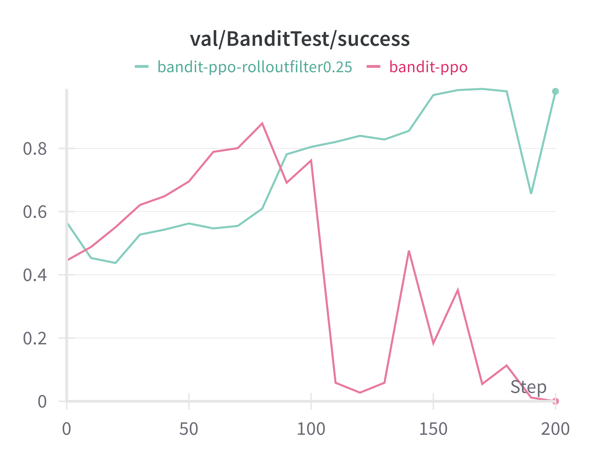
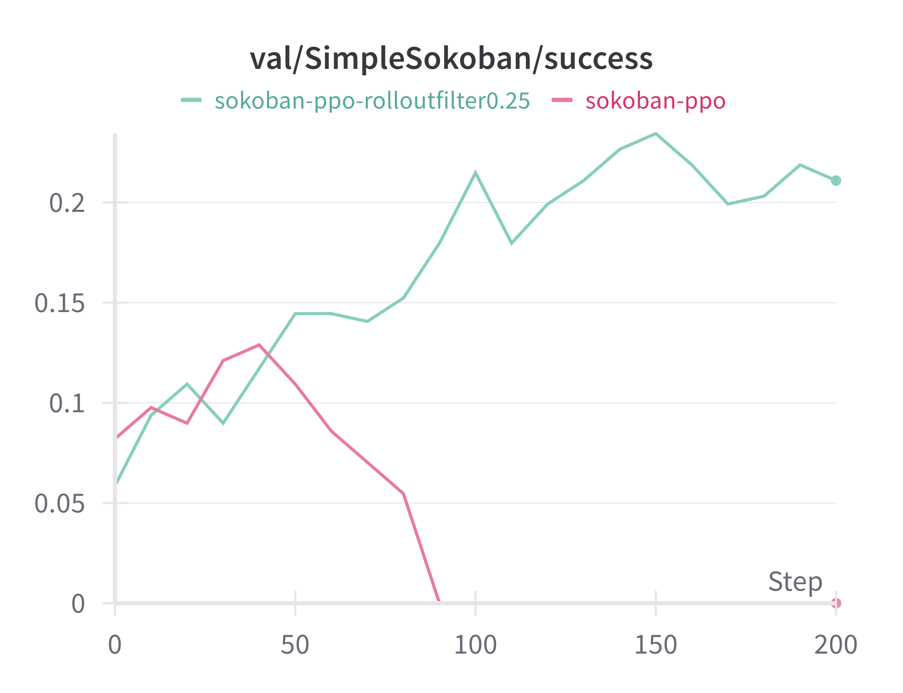
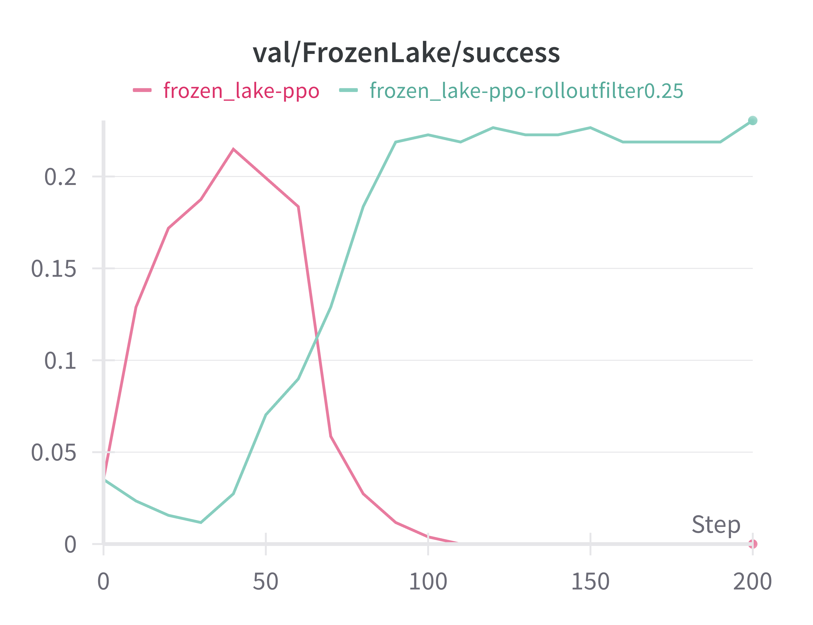
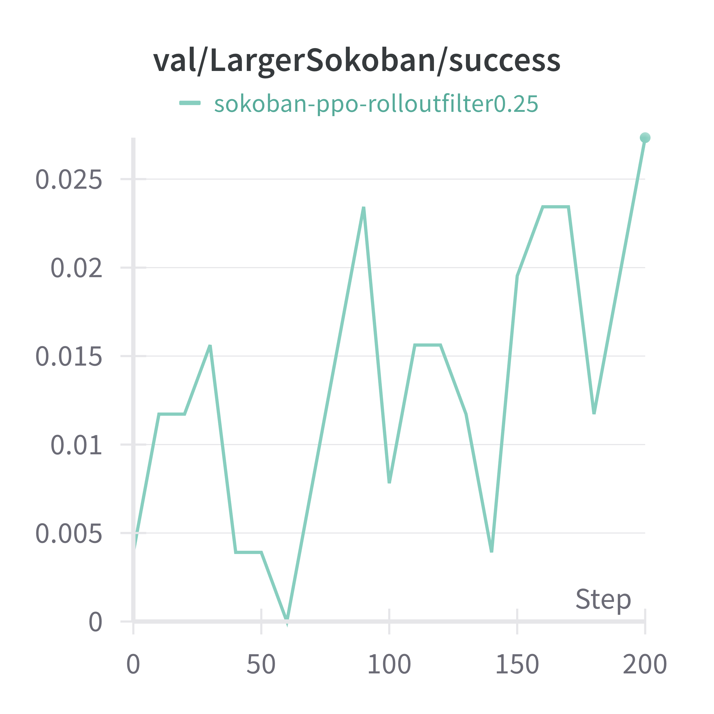
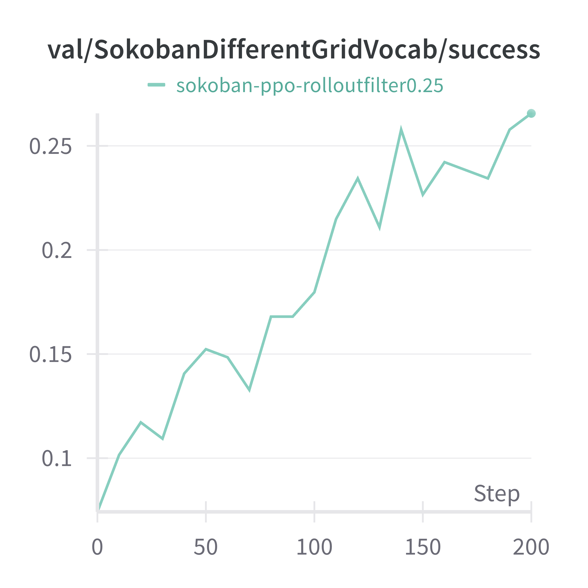
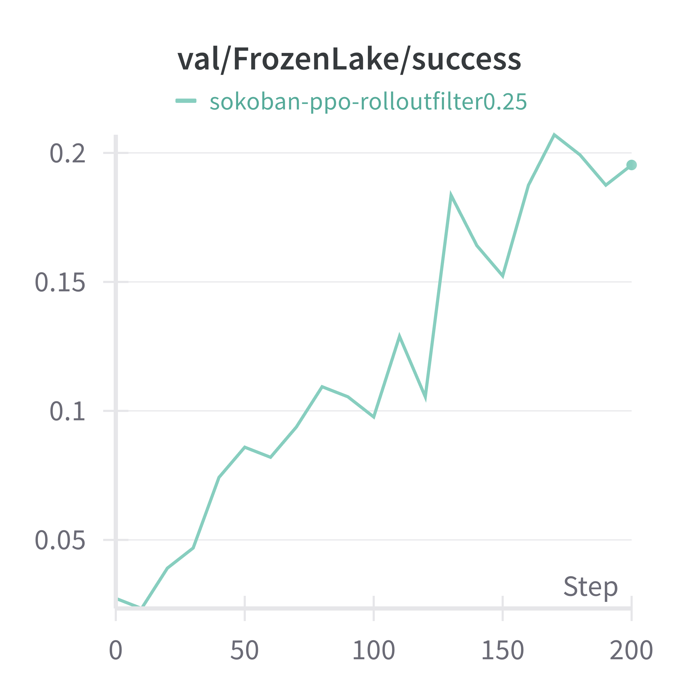
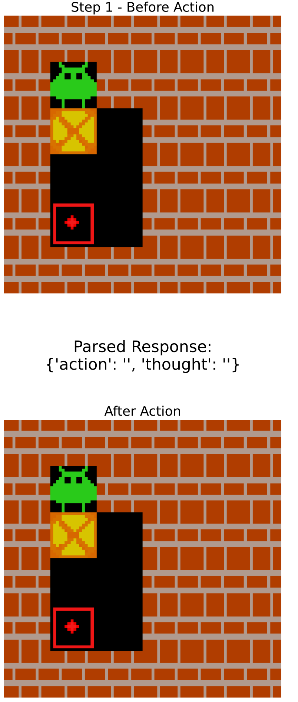
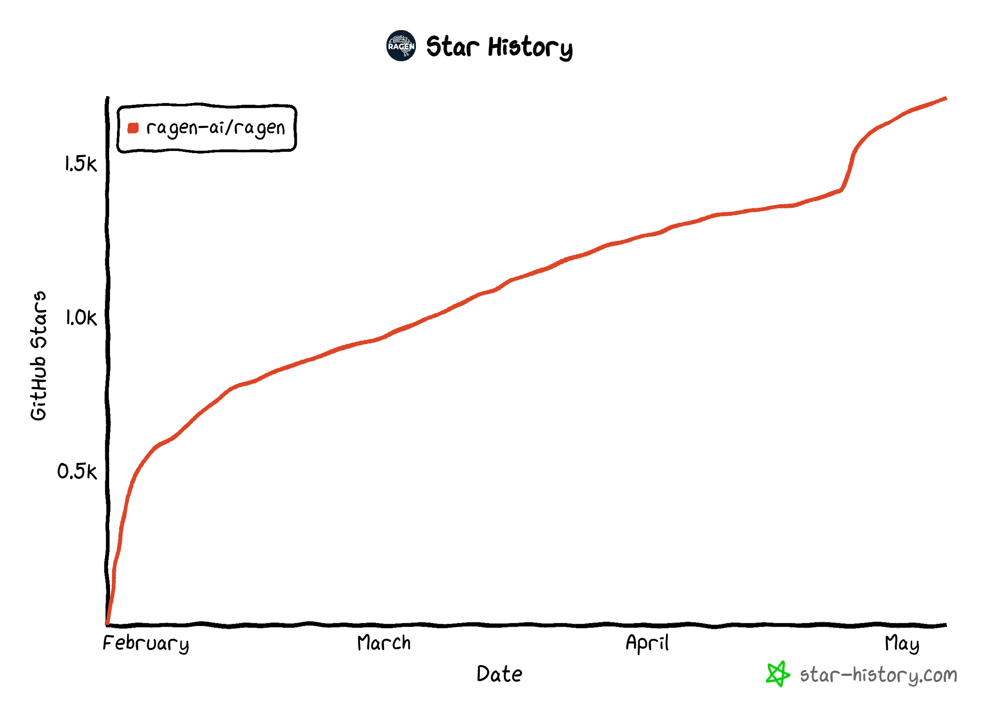

<h1 align="center"> RAGEN: Training Agents by Reinforcing Reasoning </h1>


<p align="center"></p>


<p align="center" style="font-size: 18px;">
  <strong>RAGEN</strong> (<b>R</b>easoning <b>AGEN</b>t, pronounced like "region") leverages reinforcement learning (RL) to train <br>
  <strong>LLM reasoning agents</strong> in interactive, stochastic environments.<br>
  <em>We strongly believe in the future of RL + LLM + Agents. The release is a minimally viable leap forward.</em>
</p>


<p align="center">
  <a href="https://ragen-ai.github.io/"></a>
  <a href="https://arxiv.org/abs/2504.20073"></a>
  <a href="https://ragen-tutorial.readthedocs.io/"></a>
  <a href="https://x.com/wzihanw/status/1915052871474712858"></a>
  <a href="https://api.wandb.ai/links/zihanwang-ai-northwestern-university/a8er8l7b"></a>

</p>

**2025.5.8 Update:**
We now release the official [Documentation](https://ragen-tutorial.readthedocs.io/) for RAGEN. The documentation will be continuously updated and improved to provide a comprehensive and up-to-date guidance.

**2025.5.2 Update:**
We now release a [tracking document](https://docs.google.com/document/d/1bg7obeiKTExuHHBl5uOiSpec5uLDZ2Tgvxy6li5pHX4/edit?usp=sharing) to log minor updates in the RAGEN codebase. 


**2025.4.20 Update:**

Our RAGEN [paper](https://arxiv.org/abs/2504.20073) is out!

We've further streamlined the RAGEN codebase (v0423) to improve development.
1. Architecture: Restructured veRL as a submodule for better co-development
2. Modularity: Divided RAGEN into three components—Environment Manager, Context Manager, and Agent Proxy, making it significantly simpler to add new environments (details below), track environmental dynamics, and run multiple experiments


**2025.4.16 Update:**

We recently noticed that a [third-party website](https://ragen-ai.com) has been created using our project's name and content. While we appreciate the interest in the project, we'd like to clarify that this GitHub repository is the official and primary source for all code, updates, and documentation.
If we launch an official website in the future, it will be explicitly linked here.

Thank you for your support and understanding!


**2025.3.13 Update:**


We are recently refactoring RAGEN code to help you better develop your own idea on the codebase. Please checkout our [developing branch](https://github.com/ZihanWang314/RAGEN/tree/main-new). The first version decomposes RAGEN and veRL for better co-development, taking the latter as a submodule rather than a static directory.

**2025.3.8 Update:**

1. In previous veRL implementation, there is a [KL term issue](https://github.com/volcengine/verl/pull/179/files), which has been fixed in recent versions.
2. We find evidence from multiple sources that PPO could be more stable than GRPO training in [Open-Reasoner-Zero](https://x.com/rosstaylor90/status/1892664646890312125), [TinyZero](https://github.com/Jiayi-Pan/TinyZero), and [Zhihu](https://www.zhihu.com/search?type=content&q=%E6%97%A0%E5%81%8FGRPO). We have changed the default advantage estimator to GAE (using PPO) and aim to find more stable while efficient RL optimization methods in later versions.

**2025.1.27:**

We are thrilled to release RAGEN! Check out our post [here](https://x.com/wzihanw/status/1884092805598826609).


## Overview

<!--
Reinforcement Learning (RL) with rule-based rewards has shown promise in enhancing reasoning capabilities of large language models (LLMs). However, existing approaches have primarily focused on static, single-turn tasks like math reasoning and coding. Extending these methods to agent scenarios introduces two fundamental challenges:

1. **Multi-turn Interactions**: Agents must perform sequential decision-making and react to environment feedback
2. **Stochastic Environments**: Uncertainty where identical actions can lead to different outcomes

RAGEN addresses these challenges through:
- A Markov Decision Process (MDP) formulation for agent tasks
- State-Thinking-Actions-Reward Policy Optimization (StarPO) algorithm that optimizes entire trajectory distributions
- Progressive reward normalization strategies to handle diverse, complex environments
-->

Reinforcement Learning (RL) with rule-based rewards has shown promise in enhancing reasoning capabilities of large language models (LLMs). However, existing approaches have primarily focused on static, single-turn tasks like math reasoning and coding. Extending these methods to agent scenarios introduces two fundamental challenges:

1. **Multi-turn Interactions**: Agents must perform sequential decision-making and react to environment feedback
2. **Stochastic Environments**: Uncertainty where identical actions can lead to different outcomes

To address these challenges, we propose a general RL framework: **StarPO** (**S**tate-**T**hinking-**A**ctions-**R**eward **P**olicy **O**ptimization), a comprehensive RL framework that provides a unified approach for training multi-turn, trajectory-level agents with flexible control over reasoning processes, reward assignment mechanisms, and prompt-rollout structures. 
Building upon StarPO, we introduce **RAGEN**, a modular agent training and evaluation system that implements the complete training loop, including rollout generation, reward calculation, and trajectory optimization. RAGEN serves as a robust research infrastructure for systematically analyzing LLM agent training dynamics in multi-turn and stochastic environments.

## Algorithm

RAGEN introduces a reinforcement learning framework to train reasoning-capable LLM agents that can operate in interactive, stochastic environments. 

<p align="center"></p>
<p align="center" style="font-size: 16px; max-width: 800px; margin: 0 auto;">
The StarPO (State-Thinking-Action-Reward Policy Optimization) framework with two interleaved stages: <b>rollout stage</b> and <b>update stage</b>. LLM iteratively generates reasoning-guided actions to interact with the environment to obtain trajectory-level rewards for LLM update to jointly   optimize reasoning and action strategies.
</p>

The framework consists of two key components:

### > MDP Formulation 
We formulate agent-environment interactions as Markov Decision Processes (MDPs) where states and actions are token sequences, allowing LLMs to reason over environment dynamics. At time t, state $s_t$ transitions to the next state through action $a_t$ following a transition function. The policy generates actions given the trajectory history. The objective is to maximize expected cumulative rewards across multiple interaction turns.

### > StarPO: Reinforcing Reasoning via Trajectory-Level Optimization
StarPO is a general RL framework for optimizing entire multi-turn interaction trajectories for LLM agents.
The algorithm alternates between two phases:

#### Rollout Stage: Reasoning-Interaction Trajectories
Given an initial state, the LLM generates multiple trajectories. At each step, the model receives the trajectory history and generates a reasoning-guided action: `<think>...</think><ans> action </ans>`. The environment receives the action and returns feedback (reward and next state).

#### Update Stage: Multi-turn Trajectory Optimization 
After generating trajectories, we train LLMs to optimize expected rewards. Instead of step-by-step optimization, StarPO optimizes entire trajectories using importance sampling. This approach enables long-horizon reasoning while maintaining computational efficiency. 
StarPO supports multiple optimization strategies: 
- PPO: We estimate token-level advantages using a value function over trajectories
- GRPO: We assign normalized reward to the full trajectory

Rollout and update stages interleave in StarPO, enabling both online and offline learning.

<!--
### > Reward Normalization Strategies 
We implement three progressive normalization strategies to stabilize training: 
1. **ARPO**: Preserves raw rewards directly 
2. **BRPO**: Normalizes rewards across each training batch using batch statistics
3. **GRPO**: Normalizes within prompt groups to balance learning across varying task difficulties
-->

## Environment Setup
For detailed setup instructions, please check our [documentation](https://ragen-tutorial.readthedocs.io/). Here's a quick start guide:

```bash
# Setup environment for RAGEN
bash scripts/setup_ragen.sh
```

If this fails, you can follow the manual setup instructions in `scripts/setup_ragen.md`.

## Training Models
Here's how to train models with RAGEN:

### Export variables and train
We provide default configuration in `config/base.yaml`. This file includes symbolic links to:
- `config/ppo_trainer.yaml` 
- `config/envs.yaml`

The base configuration automatically inherits all contents from these two config files, creating a unified configuration system.

To train:

```bash
python train.py --config-name base
```

### Parameter efficient training with LoRA
We provide a default configuration with LoRA enabled in `config/base-lora.yaml`. To customize the LoRA settings, see the the `lora` section at the top of the configuration file.

To train with LoRA:

```bash
python train.py --config-name base-lora
```

<!--
## Supervised Finetuning (Optional)
For supervised finetuning with LoRA:

1. Create supervised finetuning data:
```bash
bash sft/generate_data.sh <env_type>
```

2. Finetune the model:
```bash
bash sft/finetune_lora.sh <env_type> <num_gpus> <save_path>
```

3. Merge LoRA weights with the base model:
```bash
python sft/utils/merge_lora.py \
    --base_model_name <base_model_name> \
    --lora_model_path <lora_model_path> \
    --output_path <output_path>
```
-->

## Visualization
Check `val/generations` in wandb


## Performance

We evaluate RAGEN across multiple environments. Below are results Qwen-2.5-0.5B-Instruct on Sokoban, Frozenlake, and Bandit. 
- No KL loss or KL penalty was applied during training
- We selectively retained only the top 25% of trajectories that successfully completed their respective tasks

<p align="center" style="display: flex; justify-content: center; align-items: center; flex-direction: column; gap: 20px; max-width: 500px; margin: 0 auto;">
    
    
    
</p>

We demonstrate RAGEN's robust generalization ability by training on simple Sokoban environments (6×6 with 1 box) and successfully evaluating performance on:
- Larger Sokoban environments (8×8 with 2 boxes)
- Simple Sokoban with alternative grid vocabulary representations
- FrozenLake environments

<p align="center" style="display: flex; justify-content: center; align-items: center; flex-direction: column; gap: 20px; max-width: 500px; margin: 0 auto;">
    
    
    
</p>

Key observations:
- By using no KL and filtering out failed trajectories, we can achieve better and stable performance
- Generalization results highlight RAGEN's capacity to transfer learned policies across varying environment complexities, representations, and domains.


<!--
## Example Trajectories

Visualization of agent reasoning on the Sokoban task:

<p align="center" style="display: flex; justify-content: center; gap: 10px;">
    
    
</p>

The visualizations show how the agent reasons through sequential steps to solve the puzzle.

## Case Studies
We provide several case studies showing the model's behavior:
- [Reward hacking](https://github.com/ZihanWang314/agent-r1/blob/main/cases/reward_hacking.txt)
- [Challenging moments](https://github.com/ZihanWang314/agent-r1/blob/main/cases/suck_moment.txt)

More case studies will be added to showcase both successful reasoning patterns and failure modes.
-->

## Modular System Design of RAGEN

We implement RAGEN as a modular system: there are three main modules: **Environment State Manager** (`ragen/llm_agent/es_manager.py`), **Context Manager** (`ragen/llm_agent/ctx_manager.py`), and **Agent Proxy** (`ragen/llm_agent/agent_proxy.py`).

- Environment State Manager (**es_manager**):
  - Supports multiple environments (different environments, same environment different seeds, same environment same seed)
  - Records states of each environment during rollout
  - Processes actions from **ctx_manager**, executes step, and returns action results (observations) to **ctx_manager** in a batch-wise manner
- Context Manager (**ctx_manager**):
  - Parses raw agent tokens into structured actions for the **es_manager**
  - Formats observation from **es_manager**, parses and formulates them for following rollout of agent.
  - Gathers final rollout trajectories and compiles them into tokens, attention masks, reward scores, and loss masks for llm updating.
- Agent Proxy (**agent_proxy**): Serves as the interface for executing single or multi-round rollouts

## Adding Custom Environments

To add a new environment to our framework:

1. Implement an OpenAI Gym-compatible environment in `ragen/env/new_env/env.py` with these required methods:
   - `step(action)`: Process actions and return next state
   - `reset(seed)`: Initialize environment with new seed
   - `render()`: Return current state observation
   - `close()`: Clean up resources

2. Define environment configuration in `ragen/env/new_env/config.py`

3. Register your environment in `config/envs.yaml`:
   ```yaml
   custom_envs:
     - NewEnvironment # Tag
       - env_type: new_env  # Must match environment class name
       - max_actions_per_traj: 50  # Example value
       - env_instruction: "Your environment instructions here"
       - env_config: {}  # Configuration options from config.py
   ```

4. Add the environment tag to the `es_manager` section in `config/base.yaml`

## Evaluation
RAGEN provides a easy way to evaluate a model:
```bash
python -m ragen.llm_agent.agent_proxy --config-name <eval_config>
```
You only need to set model and environment to evaluate in `config/<eval_config>.yaml`

## Feedback
We welcome all forms of feedback! Please raise an issue for bugs, questions, or suggestions. This helps our team address common problems efficiently and builds a more productive community.

## Awesome work powered or inspired by RAGEN
 - [VAGEN](https://github.com/RAGEN-AI/VAGEN): Training Visual Agents with multi-turn reinforcement learning
 - [Search-R1](https://github.com/PeterGriffinJin/Search-R1): Train your LLMs to reason and call a search engine with reinforcement learning
 - [Agent-R1](https://github.com/0russwest0/Agent-R1): Training Powerful LLM Agents with End-to-End Reinforcement Learning
 - [OpenManus-RL](https://github.com/OpenManus/OpenManus-RL): A live stream development of RL tunning for LLM agents
 - [MetaSpatial](https://github.com/PzySeere/MetaSpatial): Reinforcing 3D Spatial Reasoning in VLMs for the Metaverse


## Contributors

[**Zihan Wang**\*](https://zihanwang314.github.io/), [**Kangrui Wang**\*](https://jameskrw.github.io/), [**Qineng Wang**\*](https://qinengwang-aiden.github.io/), [**Pingyue Zhang**\*](https://williamzhangsjtu.github.io/), [**Linjie Li**\*](https://scholar.google.com/citations?user=WR875gYAAAAJ&hl=en), [**Zhengyuan Yang**](https://zyang-ur.github.io/), [**Xing Jin**](https://openreview.net/profile?id=~Xing_Jin3), [**Kefan Yu**](https://www.linkedin.com/in/kefan-yu-22723a25b/en/), [**Minh Nhat Nguyen**](https://www.linkedin.com/in/menhguin/?originalSubdomain=sg), [**Licheng Liu**](https://x.com/liulicheng10), [**Eli Gottlieb**](https://www.linkedin.com/in/eli-gottlieb1/), [**Yiping Lu**](https://2prime.github.io), [**Kyunghyun Cho**](https://kyunghyuncho.me/), [**Jiajun Wu**](https://jiajunwu.com/), [**Li Fei-Fei**](https://profiles.stanford.edu/fei-fei-li), [**Lijuan Wang**](https://www.microsoft.com/en-us/research/people/lijuanw/), [**Yejin Choi**](https://homes.cs.washington.edu/~yejin/), [**Manling Li**](https://limanling.github.io/)

*:Equal Contribution.

## Acknowledgements
We thank the [DeepSeek](https://github.com/deepseek-ai/DeepSeek-R1) team for providing the DeepSeek-R1 model and early conceptual inspirations. We are grateful to the [veRL](https://github.com/volcengine/verl) team for their infrastructure support. We thank the [TinyZero](https://github.com/Jiayi-Pan/TinyZero) team for their discoveries that informed our initial exploration. We would like to appreciate insightful discussions with Han Liu, Xinyu Xing, Li Erran Li, John Schulman, Akari Asai, Eiso Kant, Lu Lu, Runxin Xu, Huajian Xin, Zijun Liu, Weiyi Liu, Weimin Wu, Yibo Wen, Jiarui Liu, Lorenzo Xiao, Ishan Mukherjee, Anabella Isaro, Haosen Sun, How-Yeh Wan, Lester Xue, Matthew Khoriaty, Haoxiang Sun, Jiajun Liu.

## Star History

<p align="center" style="display: flex; justify-content: center; align-items: center; flex-direction: column; gap: 20px; max-width: 500px; margin: 0 auto;">
    
</p>

## Citation
If you find RAGEN useful, we would appreciate it if you consider citing our work:
```md
@misc{ragen,
      title={RAGEN: Understanding Self-Evolution in LLM Agents via Multi-Turn Reinforcement Learning}, 
      author={Zihan Wang and Kangrui Wang and Qineng Wang and Pingyue Zhang and Linjie Li and Zhengyuan Yang and Xing Jin and Kefan Yu and Minh Nhat Nguyen and Licheng Liu and Eli Gottlieb and Yiping Lu and Kyunghyun Cho and Jiajun Wu and Li Fei-Fei and Lijuan Wang and Yejin Choi and Manling Li},
      year={2025},
      eprint={2504.20073},
      archivePrefix={arXiv},
      primaryClass={cs.LG},
      url={https://arxiv.org/abs/2504.20073}, 
}
```
