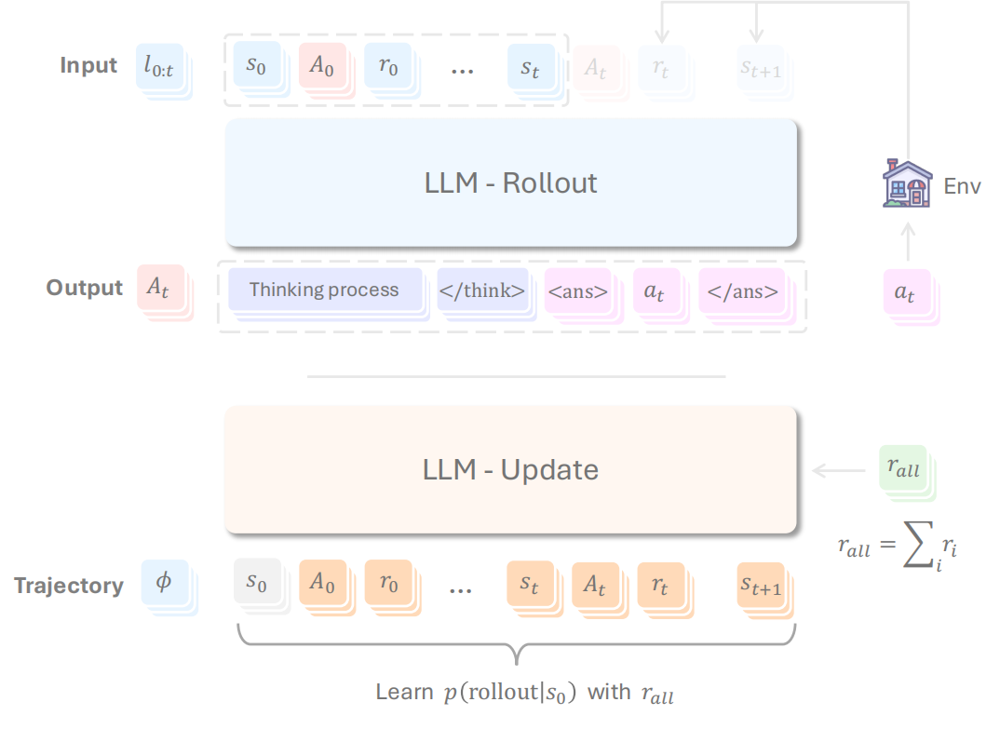
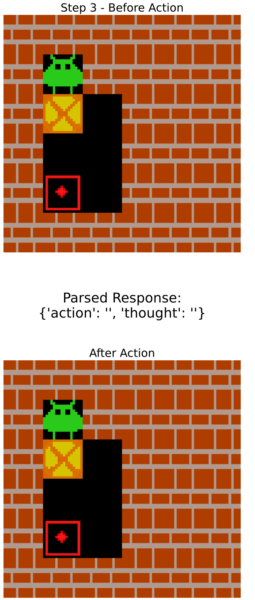
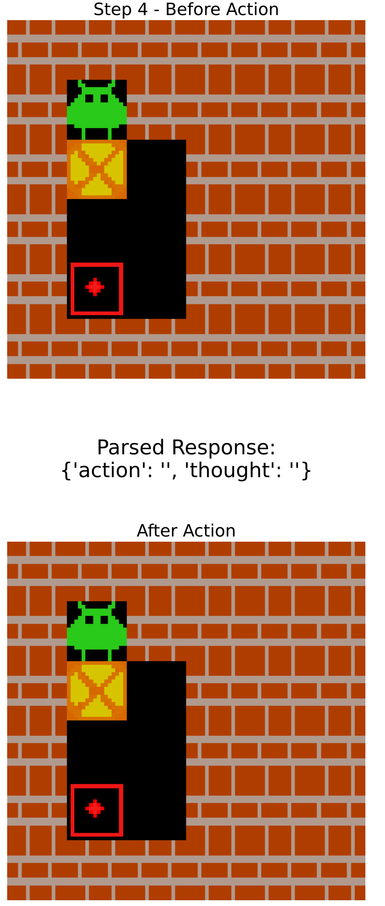
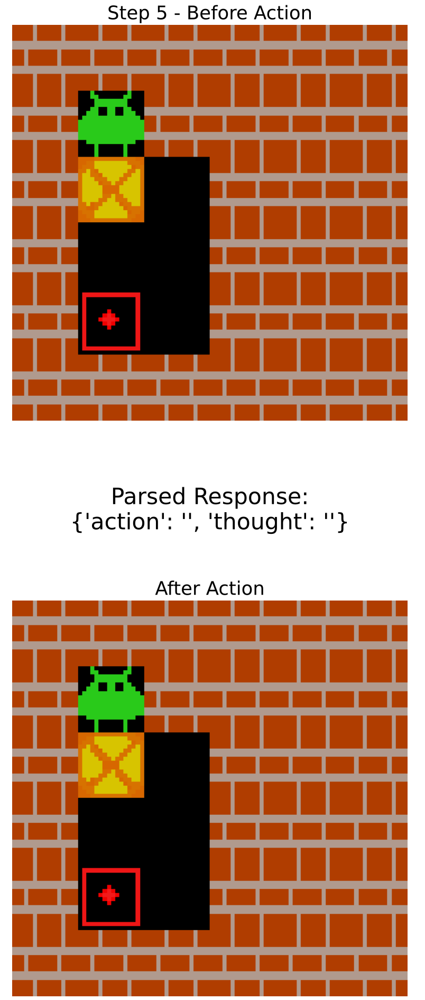

# RAGEN: A General-Purpose Reasoning Agent Training Framework

<p align="center" style="font-size: 18px;">
  <strong>RAGEN</strong> is the first reproduction of the <strong>DeepSeek-R1(-Zero)</strong> methods for <em>training agentic models</em>.<br>
  <em>We strongly believe in the future of RL + LLM + Agents. The release is a minimally viable leap forward.</em>
</p>


## Framework



<p align="center" style="font-size: 16px;">
Figure: Rollout and Update Pipeline
</p>


### Rollout Phase
During rollout, we have two types of tokens
* **Environment tokens** (shown in blue): Generated by the simulator/env, including states $s$ and rewards $r$
* **LLM-generated tokens** (shown in red): Including both thinking tokens $t$ and action tokens $a$

The input consists of a sequence $s_0,A_0,r_0...s_t$, and the output is $A_t$, which contains both thinking $t_t$ and answer $a_t$, where only $a_t$ will be sent to the simulator. While the LLM could potentially generate the entire trajectory given the current state and history trajectory information, we implement a forced truncation after the first generated answer.

The process flow is as follows:
* Given $s_0,A_0,r_0,s_1..s_t$, the LLM tries to generate $A_t,s_{t+1}...s_k$
* A forced truncation is performed to get $A_t$, which contains reasoning (`<think>...</think>`) and answer (`<ans>...</ans>`)
* $a_t$ is extracted from $A_t$ and fed into the simulator to obtain $r_t$ and $s_{t+1}$
* $A_t$, $r_t$ and $s_{t+1}$ are appended to the existing trajectory to form the new input
* After $k$ rounds of rollout, obtaining the sequence $s_0,A_0,r_0,s_1...s_k$ to train the model
* Rollouts are Generated in batch


### Update Phase
During the update phase:
* Compute and back propagate loss for the tokens in orange
* Reward calculation: parsing $r_0,...r_{k-1}$ from the trajectory tokens using regex-based rules
* Final reward computation: $r = {\rm sum}(r_0,...r_{k-1})$ for each rollout generated


### Benefits
* **Unified Multi-round Processing**: Maintains consistency by avoiding new instance creation that could destabilize batch sizes
* **World Modeling**: Potentially enables world modeling (state and reward prediction), helps LLM-agent to plan

## Guidelines
Please check out the [documentation](https://ragen-tutorial.readthedocs.io/) for a comprehensive guideline of the RAGEN framework, including QuickStart, Configuration Tutorial, and Examples (under implementation).


## Performance

We run RAGEN on Qwen-2.5-{0.5B, 3B}-{Instruct, None} and DeepSeek-R1-Distill-Qwen-1.5B, on the [Gym-Sokoban](https://github.com/mpSchrader/gym-sokoban) task. 

About the sokoban task (from the official repo): Sokoban is Japanese for warehouse keeper and a traditional video game. The game is a transportation puzzle, where the player has to push all boxes in the room on the storage locations/ targets. The possibility of making irreversible mistakes makes these puzzles so challenging especially for Reinforcement Learning algorithms, which mostly lack the ability to think ahead.

NOTE: See [Visualization](https://github.com/ZihanWang314/ragen/#visualization) Section for details. The maximum reward of this environment is **10.9**. Action spaces are 0-4 (0: Stand, 1: Up, 2: Down, 3: Left, 4: Right).


The loss curve have not converged (since our compute is currently limited...). But we already see some trends:
 - Instruct-finetuned models are not significantly advantaged ahead Pretrained-only models, although they are better at start.
 - 3B models are performing better than 0.5B models as well, but the advantages are also not that obvious at around 40 steps.
 - Interestingly, R1-distilled 1.5B model do less well than 0.5B models for now.

We prepare to release a complete wandb plot for these experiment runs, although you can try it your own and it may even be faster than our run (reasons above).


## Environment Setup
Please checkout the [documentation](https://ragen-tutorial.readthedocs.io/) for more details. Here we provide a simple guideline for RAGEN setup.
To setup environment and download data (7MB), you can run:
```bash
bash scripts/setup_ragen.sh

python scripts/download_data.py
```
if it fails, you can try to run the lines in `scripts/setup_ragen.md` manually.


## Train Models
Please checkout the [documentation](https://ragen-tutorial.readthedocs.io/) for more details. Here we provide a simple guideline to train models with RAGEN.
### Create data

On the [Gym-Sokoban](https://github.com/mpSchrader/gym-sokoban) and [FrozenLake](https://gymnasium.farama.org/environments/toy_text/frozen_lake/) tasks, We create 10k first-round-observation data for training, respectively.

<details>
<summary>Click here to see how to synthesize data manually.</summary>

You can choose to generate basic data or holisitic data for research purpose.
```bash
# basic data creation
bash scripts/create_data.sh

# holisitic data creation for research purpose
bash scripts/create_data_full.sh
```

If you want to upload data to huggingface:
```python
from huggingface_hub import HfApi
api = HfApi()
api.create_repo(repo_id='ZihanWang314/ragen-datasets', repo_type='dataset')
api.upload_folder(
    folder_path='data/',
    repo_id='ZihanWang314/ragen-datasets',
    repo_type='dataset'
)
```
</details>

<details>
<summary>Click here to see full data summarization.</summary>

#### Sokoban Dataset Variants

The following table shows the different configurations available for the Sokoban environment:

| Dataset Name | Grid Size (DIM_X × DIM_Y) | Number of Boxes | Search Depth | Description |
|-------------|--------------------------|----------------|--------------|-------------|
| sokoban     | 6 × 6                   | 1              | 30           | Standard settings |
| sokoban_hard| 6 × 6                   | 1              | 100          | Harder puzzles |
| sokoban_xhard| 6 × 6                  | 1              | 500          | Very challenging puzzles |
| sokoban_large| 8 × 8                  | 1              | 30           | Increased spatial complexity |
| sokoban_xlarge| 10 × 10               | 1              | 30           | Very challenging spatial complexity |
| sokoban_multi| 6 × 6                  | 2              | 30           | Strategic complexity |

Common settings across all Sokoban variants:
- MAX_STEPS: 10
- Train size: 10,000 examples
- Test size: 10 examples
- Seed: 10000

#### FrozenLake Dataset

FrozenLake environment maintains a single configuration:
- Grid Size: 6 × 6
- Frozen tile percentage (P): 0.8
- Train size: 10,000 examples
- Test size: 10 examples
- Seed: 100000

</details>


### Export variables and train
We provide a default config file in `verl/trainer/config/ppo_trainer.yaml`. You can change the parameters in the file. Below scripts would train two Agents on these two tasks, respectively. 

To understand and reproduce our experiments, please checkout `cmd.md` for the command we use for each experiment.

NOTE: All possible arguments are in config/base.yaml and other yaml files.

```bash
bash train.sh sokoban \
    model.experiment_name=new_test

# override config
bash train.sh sokoban \
    model.experiment_name=new_test_debug \
    training.train_batch_size=128 \
    training.ppo_batch_size=64

# For developers, if you want to add your own config keys, please check [ base.yaml | train.sh | ragen/train.py | verl/trainer/config/ppo_trainer.yaml | and the main_ppo.py in verl/trainer/ppo ] to make sure the changes are reflected coherently.
```


## Supervised Finetuning (Optional)
NOTE: Only tested with 1 GPU
1. Create supervised finetuning data, and parquet files will be saved in `sft/data/<env_type>/`
  - BFS is used to generate shortest action path for a given sokoban environment
  - The data then fomulated as chat dataset.
```bash
bash sft/generate_data.sh <env_type>
```

2. Finetune the model (with LoRA)
  - setting arguments in `sft/finetune_lora.sh`
  - By setting `model.lora_rank=0`, we can turn off lora finetuning

```bash
bash sft/finetune_lora.sh <env_type> <num_gpus> <save_path>
```

3. Merge the LoRA weights with the base model
  - Currently verl main_ppo.py seems not support loading LoRA weights, so we need to merge them with the base model.
```bash
python sft/utils/merge_lora.py \
    --base_model_name <base_model_name> \
    --lora_model_path <lora_model_path> \
    --output_path <output_path>
```

4. Use SFT model for RL training
  - By setting `BASE_MODEL` to the merged model path, we can use the SFT model for RL training.


## All Experiments


## Visualization
1. By setting arguments in `train.sh`, you can visualize the trajectory:
```bash
logging.log_images=True # set to True to log images
logging.log_image_dir=log/trajectory # set to the directory to save images
logging.log_image_step_size=4 # save image every _ steps
logging.log_n_image_per_batch=32 # save _ images per batch
```

You may use this command to visualize the trajectory:
```bash
cd log/trajectory
python -m http.server 8000
# check http://localhost:8000/[EXP_NAME]/step_[STEP_NUM]/trajectory_data_[ID].html
```

2. You may also need to install fonts to make the figures displayed correctly:
```bash
sudo apt-get install fonts-noto-cjk
```

3. Example image for one trajectory: 
<p align="center" style="display: flex; justify-content: center; gap: 10px;">
    
    
<!--     
    
     -->
</p>


4. Download visualization data from wandb:
```python
from ragen.utils.wandb import download_wandb
download_wandb("RUN_ID") # e.g., 9o465jqj
```

## Cases
Please see cases/ file.
There are only limited cases for now, including [reward hacking](https://github.com/ZihanWang314/agent-r1/blob/main/cases/reward_hacking.txt) and the [suck moment](https://github.com/ZihanWang314/agent-r1/blob/main/cases/suck_moment.txt). we will add more cases recently.

## Feedback

We welcome all sorts of feedback! Please just raise an issue, no matter if it's any bugs you find or specific questions / suggestions regarding the project, so our team members won't be answering similar problems multiple times and thus would lead to more productive and efficient community building. Cheers!


## Authors

[Zihan Wang*](https://zihanwang314.github.io/)

[Kangrui Wang](https://jameskrw.github.io/)

[Qineng Wang](https://qinengwang-aiden.github.io/)

[Pingyue Zhang](https://williamzhangsjtu.github.io/)

[Manling Li†](https://limanling.github.io)

*: Project Lead; †: Advising.
Remaining authors are alphabetical order.


## Acknowledgements


We thank [DeepSeek](https://github.com/deepseek-ai/DeepSeek-R1) for providing the DeepSeek-R1 model and ideas. We thank the [veRL](https://github.com/volcengine/verl) team for their infrastructure. We thank the [TinyZero](https://github.com/Jiayi-Pan/TinyZero) team for their discoveries that inspired our early exploration. We thank Yiping Lu, Runxin Xu, Kyunghyun Cho for insightful discussions with them.

## Citation
```md
@misc{RAGEN,
  author       = {Zihan Wang and Kangrui Wang and Qineng Wang and Pingyue Zhang and Manling Li},
  title        = {RAGEN: A General-Purpose Reasoning Agent Training Framework},
  year         = {2025},
  organization = {GitHub},
  url          = {https://github.com/ZihanWang314/ragen},
}
```
