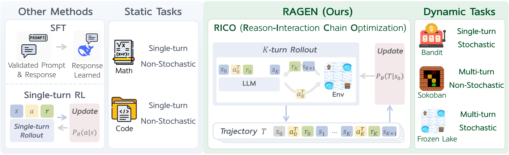
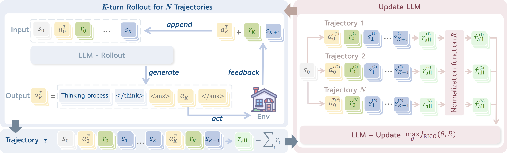
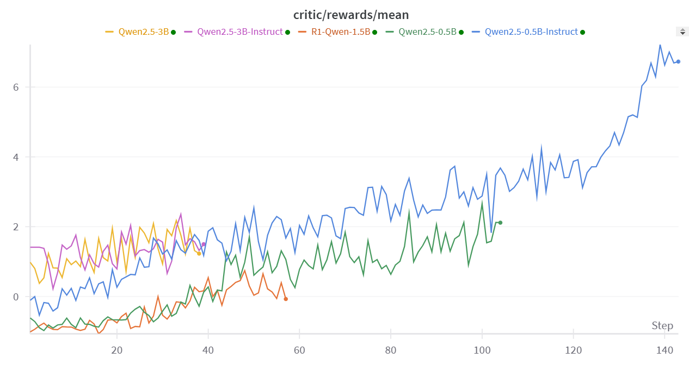

<h1 align="center"> RAGEN: Training Agents by Reinforcing Reasoning </h1>


<p align="center"></p>
<p align="center" style="font-size: 18px;">
  <strong>RAGEN</strong> (<b>R</b>easoning <b>AGEN</b>t, pronounced like "region") leverages reinforcement learning (RL) to train <br>
  <strong>LLM reasoning agents</strong> in interactive, stochastic environments.<br>
  <em>We strongly believe in the future of RL + LLM + Agents. The release is a minimally viable leap forward.</em>
</p>


<p align="center">
  <a href="https://ragen-tutorial.readthedocs.io/"></a>
  <a href="#"></a>
  <a href="#"></a>
  <a href="#"></a>
</p>

**2025.4.16 Update:**
We recently noticed that a [third-party website](https://ragen-ai.com) has been created using our project's name and content. While we appreciate the interest in the project, we’d like to clarify that this GitHub repository is the official and primary source for all code, updates, and documentation.
If we launch an official website in the future, it will be explicitly linked here.

Thank you for your support and understanding!


**2025.3.13 Update:**

We are recently refactoring RAGEN code to help you better develop your own idea on the codebase. Please checkout our [developing branch](https://github.com/ZihanWang314/RAGEN/tree/main-new). The first version decomposes RAGEN and veRL for better co-development, taking the latter as a submodule rather than a static directory.

**2025.3.8 Update:**

1. In previous veRL implementation, there is a [KL term issue](https://github.com/volcengine/verl/pull/179/files), which has been fixed in recent versions.
2. We find evidence from multiple sources that PPO could be more stable than GRPO training in [Open-Reasoner-Zero](https://x.com/rosstaylor90/status/1892664646890312125), [TinyZero](https://github.com/Jiayi-Pan/TinyZero), and [Zhihu](https://www.zhihu.com/search?type=content&q=%E6%97%A0%E5%81%8FGRPO). We have changed the default advantage estimator to GAE (using PPO) and aim to find more stable while efficient RL optimization methods in later versions.

## Overview

Reinforcement Learning (RL) with rule-based rewards has shown promise in enhancing reasoning capabilities of large language models (LLMs). However, existing approaches have primarily focused on static, single-turn tasks like math reasoning and coding. Extending these methods to agent scenarios introduces two fundamental challenges:

1. **Multi-turn Interactions**: Agents must perform sequential decision-making and react to environment feedback
2. **Stochastic Environments**: Uncertainty where identical actions can lead to different outcomes

RAGEN addresses these challenges through:
- A Markov Decision Process (MDP) formulation for agent tasks
- Reason-Interaction Chain Optimization (RICO) algorithm that optimizes entire trajectory distributions
- Progressive reward normalization strategies to handle diverse, complex environments

## Algorithm

RAGEN introduces a reinforcement learning framework to train reasoning-capable LLM agents that can operate in interactive, stochastic environments. 

<p align="center"></p>
<p align="center" style="font-size: 16px; max-width: 800px; margin: 0 auto;">
The Reasoning-Interaction Chain Optimization (RICO) framework with two interleaved stages: <b>rollout stage</b> and <b>update stage</b>. LLM iteratively generates reasoning-guided actions to interact with the environment to obtain trajectory-level rewards, normalized for LLM update to jointly optimize reasoning and action strategies.
</p>


## Algorithm

RAGEN introduces a reinforcement learning framework to train reasoning-capable LLM agents that can operate in interactive, stochastic environments. The framework consists of two key components:

### > MDP Formulation 
We formulate agent-environment interactions as Markov Decision Processes (MDPs) where states and actions are token sequences, allowing LLMs to reason over environment dynamics. At time t, state $s_t$ transitions to the next state through action $a_t$ following a transition function. The policy generates actions given the trajectory history. The objective is to maximize expected cumulative rewards across multiple interaction turns.

### > Reasoning-Interaction Chain Optimization 
RICO enables LLMs to jointly optimize reasoning and action strategies over entire trajectories. The algorithm alternates between two phases:

#### Rollout Stage: Reasoning-Interaction Chain Generation 
Given an initial state, the LLM generates multiple trajectories. At each step, the model receives the trajectory history and generates a reasoning-guided action: `<think>...</think><ans> action </ans>`. The environment receives the action and returns feedback (reward and next state).

#### Update Stage: Multi-turn Trajectory Optimization 
After generating trajectories, we train LLMs to optimize expected rewards. Instead of step-by-step optimization, RICO optimizes entire trajectories based on normalized trajectory-level rewards. This approach enables long-horizon reasoning while maintaining computational efficiency.

### > Reward Normalization Strategies 
We implement three progressive normalization strategies to stabilize training: 
1. **ARPO**: Preserves raw rewards directly 
2. **BRPO**: Normalizes rewards across each training batch using batch statistics
3. **GRPO**: Normalizes within prompt groups to balance learning across varying task difficulties

## Environment Setup
For detailed setup instructions, please check our [documentation](https://ragen-tutorial.readthedocs.io/). Here's a quick start guide:

```bash
# Setup environment and download data (7MB)
bash scripts/setup_ragen.sh
python scripts/download_data.py
```

If this fails, you can follow the manual setup instructions in `scripts/setup_ragen.md`.

## Training Models
Here's how to train models with RAGEN:

### Create data
We provide 10k first-round-observation data for both Sokoban and FrozenLake tasks.

```bash
# Basic data creation
bash scripts/create_data.sh

# Or for research purposes, create more comprehensive data
bash scripts/create_data_full.sh
```

### Export variables and train
We provide default configuration in `verl/trainer/config/ppo_trainer.yaml`. To train:

```bash
bash train.sh sokoban \
    model.experiment_name=new_test

# Override config parameters as needed
bash train.sh sokoban \
    model.experiment_name=new_test_debug \
    training.train_batch_size=128 \
    training.ppo_batch_size=64
```

## Supervised Finetuning (Optional)
For supervised finetuning with LoRA:

1. Create supervised finetuning data:
```bash
bash sft/generate_data.sh <env_type>
```

2. Finetune the model:
```bash
bash sft/finetune_lora.sh <env_type> <num_gpus> <save_path>
```

3. Merge LoRA weights with the base model:
```bash
python sft/utils/merge_lora.py \
    --base_model_name <base_model_name> \
    --lora_model_path <lora_model_path> \
    --output_path <output_path>
```

## Visualization
To visualize agent trajectories:

1. Set visualization parameters in `train.sh`:
```bash
logging.log_images=True
logging.log_image_dir=log/trajectory
logging.log_image_step_size=4
logging.log_n_image_per_batch=32
```

2. View the visualizations:
```bash
cd log/trajectory
python -m http.server 8000
# Access at http://localhost:8000/[EXP_NAME]/step_[STEP_NUM]/trajectory_data_[ID].html
```

3. For proper font rendering:
```bash
sudo apt-get install fonts-noto-cjk
```

4. Download visualization data from wandb:
```python
from ragen.utils.wandb import download_wandb
download_wandb("RUN_ID") # e.g., 9o465jqj
```


## Performance

We evaluate RAGEN across multiple model sizes and configurations. Below are results from our Sokoban experiments using Qwen-2.5-{0.5B, 3B}-{Instruct, None} and DeepSeek-R1-Distill-Qwen-1.5B.



**NOTE: The loss shows the reward curve, where the KL term is considered.**

Key observations:
- Instruct-finetuned models show early advantages but the gap narrows as training progresses
- Larger models (3B) generally outperform smaller models (0.5B), though the advantage is not dramatic
- The R1-distilled 1.5B model initially underperforms compared to 0.5B models
- Training has not yet converged in these experiments

Our analysis reveals two key aspects of LLM agent training with RL:
1. **Prompt diversity**: Balancing observation variety and effective response comparison
2. **Online rollout frequency**: Mediating between training stability and data recency

## Example Trajectories

Visualization of agent reasoning on the Sokoban task:

<p align="center" style="display: flex; justify-content: center; gap: 10px;">
    
    
</p>

The visualizations show how the agent reasons through sequential steps to solve the puzzle.

## Case Studies
We provide several case studies showing the model's behavior:
- [Reward hacking](https://github.com/ZihanWang314/agent-r1/blob/main/cases/reward_hacking.txt)
- [Challenging moments](https://github.com/ZihanWang314/agent-r1/blob/main/cases/suck_moment.txt)

More case studies will be added to showcase both successful reasoning patterns and failure modes.

## Feedback
We welcome all forms of feedback! Please raise an issue for bugs, questions, or suggestions. This helps our team address common problems efficiently and builds a more productive community.

## Awesome work powered or inspired by RAGEN
 - [VAGEN](https://github.com/RAGEN-AI/VAGEN): Training Visual Agents with multi-turn reinforcement learning
 - [Search-R1](https://github.com/PeterGriffinJin/Search-R1): Train your LLMs to reason and call a search engine with reinforcement learning
 - [Agent-R1](https://github.com/0russwest0/Agent-R1): Training Powerful LLM Agents with End-to-End Reinforcement Learning
 - [OpenManus-RL](https://github.com/OpenManus/OpenManus-RL): A live stream development of RL tunning for LLM agents
 - [MetaSpatial](https://github.com/PzySeere/MetaSpatial): Reinforcing 3D Spatial Reasoning in VLMs for the Metaverse


## Contributors

[**Zihan Wang**\*](https://zihanwang314.github.io/), [**Kangrui Wang**\*](https://jameskrw.github.io/), [**Qineng Wang**\*](https://qinengwang-aiden.github.io/), [**Pingyue Zhang**\*](https://williamzhangsjtu.github.io/), [**Linjie Li**\*](https://scholar.google.com/citations?user=WR875gYAAAAJ&hl=en), [**Zhengyuan Yang**](https://zyang-ur.github.io/), [**Kefan Yu**](https://www.linkedin.com/in/kefan-yu-22723a25b/en/), [**Minh Nhat Nguyen**](https://www.linkedin.com/in/menhguin/?originalSubdomain=sg), [**Monica Lam**](https://suif.stanford.edu/~lam/), [**Yiping Lu**](https://2prime.github.io/), [**Kyunghyun Cho**](https://kyunghyuncho.me/), [**Jiajun Wu**](https://jiajunwu.com/), [**Li Fei-Fei**](https://profiles.stanford.edu/fei-fei-li), [**Lijuan Wang**](https://www.microsoft.com/en-us/research/people/lijuanw/), [**Yejin Choi**](https://homes.cs.washington.edu/~yejin/), [**Manling Li**](https://limanling.github.io/)

*:Equal Contribution.

## Acknowledgements
We thank [DeepSeek](https://github.com/deepseek-ai/DeepSeek-R1) for providing the DeepSeek-R1 model and ideas. We thank the [veRL](https://github.com/volcengine/verl) team for their infrastructure. We thank the [TinyZero](https://github.com/Jiayi-Pan/TinyZero) team for their discoveries that inspired our early exploration. We thank Licheng Liu, Eli Gottlieb, Jiajun Liu for helping explore stable RL algorithms. We thank Han Liu, Xinyu Xing, Li Erran Li, Akari Asai, Eiso Kant, Lu Lu, Runxin Xu, Huajian Xin, Zijun Liu, Weiyi Liu, Weimin Wu, Yibo Wen, Jiarui Liu, Lorenzo Xiao, Ishan Mukherjee, Anabella Isaro, Haosen Sun, How-Yeh Wan, Lester Xue, Weiyi Liu for insightful discussions.

## Citation
```md
@misc{RAGEN,
  author       = {Zihan Wang* and Kangrui Wang* and Qineng Wang* and Pingyue Zhang* and Linjie Li* and Zhengyuan Yang and Kefan Yu and Minh Nhat Nguyen and Monica Lam and Yiping Lu and Kyunghyun Cho and Jiajun Wu and Li Fei-Fei and Lijuan Wang and Yejin Choi and Manling Li},
  title        = {Training Agents by Reinforcing Reasoning},
  year         = {2025},
  organization = {GitHub},
  url          = {https://github.com/ZihanWang314/ragen},
}
```
